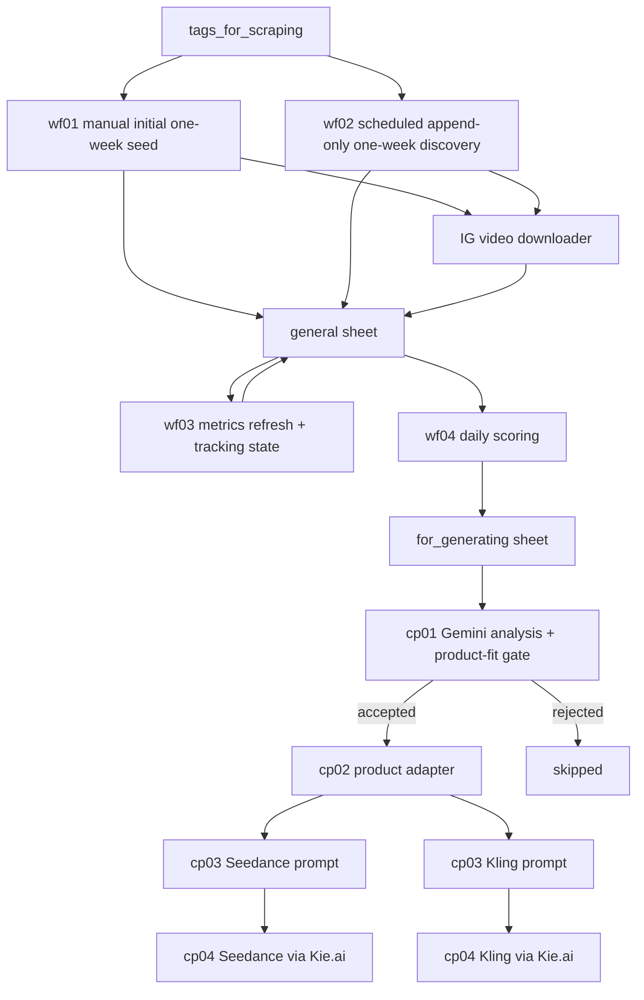

# Instagram Trend-to-Creative Pipeline

This repository contains an end-to-end n8n + Google Sheets pipeline for discovering Instagram Reels that are starting to trend, tracking their growth, selecting the strongest candidates, adapting their creative structure to a product, and generating new videos with Seedance or Kling through Kie.ai.

The repository is intentionally split into two modules. Trend discovery can run on its own, and creative production can accept rows from any compatible source through the `for_generating` sheet contract.

## What It Does

The discovery module monitors selected Instagram hashtags, collects top and recent Reels, deduplicates already-known posts, refreshes performance metrics over time, and surfaces the best-performing videos every day.

The creative-production module analyzes shortlisted videos with Gemini, applies configurable market and product-fit gates, adapts the reusable concept to a product, generates model-specific prompts, and creates videos through either Seedance or Kling.

Both modules communicate through `for_generating`. You can use the full pipeline or populate that sheet yourself and start directly from creative production.

## Spreadsheet Structure

The workflows expect a Google Spreadsheet with these sheets:

| Sheet | Purpose |
| --- | --- |
| `tags_for_scraping` | The list of hashtags to monitor. Each row is a hashtag input for the scraping workflows. |
| `general` | The main database of scraped Instagram posts and Reels. Stores URLs, captions, authors, metrics, media links, Google Drive links, and workflow status. |
| `shortcode` | A lightweight lookup sheet used by the dedup workflow to avoid appending Reels that are already present. |
| `for_generating` | The output queue. Daily top Reels are appended here so the creative team can use them for generation or cloning workflows. |

## n8n Data Tables

The pipeline also uses native n8n Data Tables for workflow state.

### `IG Metrics Tracking State`

Used by `wf03` to decide which URLs are due and to permanently exclude stagnant posts before paid Apify calls.

Core fields:

| Column | Type | Purpose |
| --- | --- | --- |
| `url` | string | Join/upsert key |
| `shortcode` | string | Instagram shortcode |
| `tracking_status` | string | `active` or `stopped_stagnant` |
| `last_checked_at`, `next_check_at` | dateTime | Daily scheduling state |
| `last_views`, `delta_views` | number | Latest views and change |
| `window_started_at` | dateTime | Start of the 72-hour evaluation window |
| `window_start_views` | number | Baseline views |
| `growth_3d_pct` | number | Window growth ratio |
| `stopped_at` | dateTime | Permanent-stop time |
| `stop_reason` | string | Stop reason |

### Daily Top Reels Snapshot Table

Used by `wf04` to remember previous metrics for scoring and momentum detection. The imported workflow includes a sticky note with the required setup details. At minimum, it stores the Reel `shortcode`, previous views, previous likes, and the previous seen timestamp.

## Apify Actors

| Actor | Used by | Purpose |
| --- | --- | --- |
| `khadinakbar/instagram-hashtag-scraper` (ID `XxaKfMpcnemfuNxSc`) | `wf01`, `wf02` | Collects up to 50 posts per hashtag from the last week, without comments |
| `apify/instagram-post-scraper` | `wf03` | Refreshes already-collected post metrics in batches of up to 50 URLs |

## Workflow Overview

## Workflows

Detailed workflow documentation:

- [wf01: IG Top Hashtags Scraping](wf01-ig-tophashtags-scraping.md)
- [wf02: IG Hashtags Scraping - Dedup Append Only](wf02-ig-hashtags-scraping-dedup-append-only.md)
- [wf03: IG Top Hashtags Scraping - Update Metrics](wf03-ig-tophashtags-scraping-update-metrics.md)
- [wf04: Daily Top Reels](wf04-daily-top-reels.md)
- [IG Video Scrapper Download](ig-video-scrapper-download.md)
- [Creative production overview](docs/creative-production.md)
- [`for_generating` sheet contract](docs/for-generating-schema.md)
- [Seedance setup](docs/seedance.md)
- [Kling setup](docs/kling.md)

Each creative-production JSON file also has a detailed Markdown guide beside it, matching the documentation pattern used by the discovery workflows.

### `wf01 IG_tophashtags_scraping.json`

Manual, unpublished seed workflow. It reads existing `general` rows and monitored hashtags, calls the same one-week Actor/configuration as `wf02`, normalizes the response, and upserts by `shortcode`. Existing non-empty statuses are preserved; new rows start as `scraped`. It then calls the shared downloader.

### `wf02 IG_hashtags_scraping - dedup append only.json`

Scheduled incremental workflow (hourly at minute 20 in the configured n8n timezone). It preloads known shortcodes from the lookup sheet and workflow static data, calls `khadinakbar/instagram-hashtag-scraper`, normalizes results, rejects missing/known shortcodes, and appends only new rows with `status = scraped`. Existing rows are never updated by this workflow.

### `wf03 IG_tophashtags_scraping_UPDATE_Metrics.json`

Published view-growth tracker. It joins all `general` rows to the tracking Data Table, excludes `stopped_stagnant` and future-due rows before Apify, prioritizes tracked rows, and caps each run at 1,000 posts. URLs are sent in batches of 50.

The stop decision uses only views (`max` of available view counters). Each post is checked at most daily and evaluated over a 72-hour window. Growth below 10% permanently sets `stopped_stagnant`; growth of at least 10% starts a new window.

### `wf04 Daily_Top_Reels.json`

Daily 02:20 ranking and delivery workflow. Eligible rows must be Reels, have at least 10,000 views, and have at least a 1% like rate. The score combines views percentile (30%), like-rate percentile (30%), engagement percentile (20%), recency (20%), and an optional 0.10 momentum bonus.

The highest-ranked five unused rows are appended to `for_generating`, marked `moved_to_top` in `general`, and sent to Slack. All eligible rows update the snapshot branch. See the detailed guide for formulas, routing, and the current `prev_*` snapshot mismatch that makes momentum unreliable.

### `IG video sccrapper Download.json`

Shared helper called by `wf01` and `wf02`. It filters downloadable Reels, normalizes the Instagram CDN host, resolves IPv4, downloads with the original Host header, uploads the binary to Google Drive, and writes `gd_file_id`, `link_to_gdrive`, and `status = downloaded` back to `general`.

## Recommended Operating Flow

1. Add hashtags to `tags_for_scraping`.
2. Run `wf01` manually to collect the initial one-week seed scope.
3. Keep `wf02` enabled to append newly discovered posts.
4. Enable `wf03` to refresh metrics and track growth while avoiding unnecessary Apify runs.
5. Enable `wf04` to move the strongest daily candidates into `for_generating`.
6. Run `cp01` to analyze queued videos and reject candidates that fail the configured gates.
7. Run `cp02` to adapt accepted creative DNA to the configured product.
8. Choose Seedance, Kling, or both: run the matching `cp03` prompt generator and `cp04` video generator.

All six creative-production workflows use manual triggers on purpose. Replace the trigger after import if you prefer a schedule, webhook, Execute Sub-workflow node, or another orchestration strategy.

## Current wf04 Momentum Limitation

The current `wf04` code expects `prev_views`, `prev_likes`, and `prev_seen_ts`, but the configured snapshot write does not reliably produce those aliases. Audited runs treated all eligible rows as new. Reach/engagement/recency ranking and top-five routing still work; momentum is not considered verified.

See [wf04: Daily Top Reels](wf04-daily-top-reels.md) for the exact selection, table, snapshot, and Slack rules.

## Setup Notes

- Import all JSON workflows into n8n.
- Reconnect Google Sheets, Google Drive, and Apify credentials after import.
- Discovery exports use `YOUR_*` resource placeholders. Reconnect every credential and select your own Sheets, Drive, Data Tables, Slack channel, and child workflows after import.
- Replace `YOUR_GOOGLE_DRIVE_ID` and `YOUR_OUTPUT_FOLDER_ID` in Google Drive upload nodes.
- Update n8n Data Table IDs for your own workspace.
- Create the required n8n Data Tables before running `wf03` and `wf04`.
- Imported nodes should be checked once in the n8n UI because Data Table references and credential selections are instance-specific.
- Creative-production workflows require a compatible template spreadsheet. Select or copy your own sheet before using it with private data.
- Edit the `Pipeline Config` Code node in every creative-production workflow to change the product context, target markets, scoring thresholds, target duration, or generation model.
- Reconnect the generic Google Sheets, Google Drive, Gemini, OpenAI, and Kie.ai credential placeholders after importing the creative-production workflows.
- In both video-generator workflows, replace `YOUR_GOOGLE_DRIVE_ID` and `YOUR_OUTPUT_FOLDER_ID` in the `Upload file` node.

## Repository Description

Short GitHub description:

> End-to-end n8n pipeline for discovering trending Instagram Reels, scoring and adapting creative concepts, and generating videos with Gemini, Seedance, Kling, and Kie.ai.
