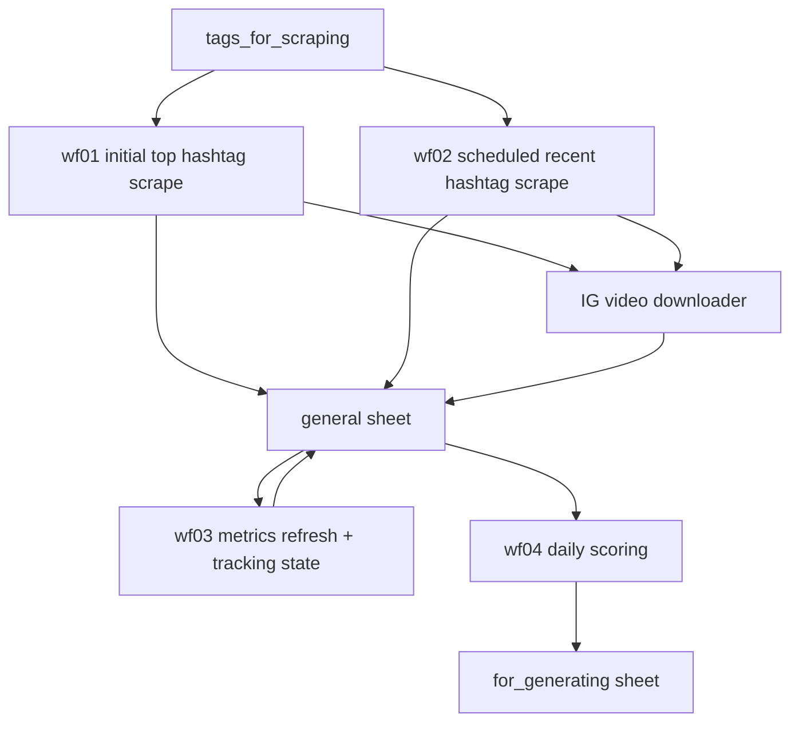

# Instagram Trend Discovery Pipeline

This repository contains a small n8n + Google Sheets pipeline for discovering Instagram Reels that are starting to trend, tracking their metric growth, and moving the strongest candidates into a production queue for creative generation.

The system is built around one Google Spreadsheet, two n8n Data Tables, four main n8n workflows, and one helper workflow for downloading Instagram videos to Google Drive.

## What It Does

The pipeline monitors selected Instagram hashtags, collects top and recent Reels, deduplicates already-known posts, refreshes performance metrics over time, and surfaces the best-performing videos every day.

The main use case is creative research: instead of manually checking Instagram for emerging trends, the pipeline keeps a growing database of candidate Reels and highlights the ones that are gaining traction through views, likes, comments, and engagement velocity.

## Spreadsheet Structure

The workflows expect a Google Spreadsheet with these sheets:

| Sheet | Purpose |
| --- | --- |
| `tags_for_scraping` | The list of hashtags to monitor. Each row is a hashtag input for the scraping workflows. |
| `general` | The main database of scraped Instagram posts and Reels. Stores URLs, captions, authors, metrics, media links, Google Drive links, and workflow status. |
| `shortcode` | A lightweight lookup sheet used by the dedup workflow to avoid appending Reels that are already present. |
| `for_generating` | The output queue. Daily top Reels are appended here so the creative team can use them for generation or cloning workflows. |

## n8n Data Tables

The pipeline also uses native n8n Data Tables for workflow state.

### `IG Metrics Tracking State`

Used by `wf03` to decide whether each post should be checked again through Apify.

Recommended columns:

| Column | Type | Purpose |
| --- | --- | --- |
| `url` | string | Post/Reel URL used as the upsert key. |
| `shortcode` | string | Instagram shortcode. |
| `tracking_status` | string | One of `active`, `cooldown`, or `paused_no_growth`. |
| `last_checked_at` | dateTime | Last time metrics were refreshed through Apify. |
| `last_growth_at` | dateTime | Last time the Reel showed metric growth. |
| `last_views` | number | Last known view count. |
| `last_likes` | number | Last known like count. |
| `last_comments` | number | Last known comment count. |
| `delta_views` | number | View growth since the previous check. |
| `delta_likes` | number | Like growth since the previous check. |
| `delta_comments` | number | Comment growth since the previous check. |
| `no_growth_checks` | number | Consecutive checks with no growth. |
| `next_check_at` | dateTime | Next time this URL should be sent to Apify. |

### Daily Top Reels Snapshot Table

Used by `wf04` to remember previous metrics for scoring and momentum detection. The imported workflow includes a sticky note with the required setup details. At minimum, it stores the Reel `shortcode`, previous views, previous likes, and the previous seen timestamp.

## Apify Actors

The workflows use these Apify actors:

| Actor | Used by | Purpose |
| --- | --- | --- |
| Instagram Hashtag Posts Scraper (`breathtaking_anthem/instagram-hashtag-posts-scraper`) | `wf01`, `wf02` | Scrapes top or recent posts for each tracked hashtag. |
| Instagram Post Scraper (`apify/instagram-post-scraper`) | `wf03` | Refreshes metrics for already-collected post/Reel URLs in batches of up to 50 URLs. |

## Workflow Overview

## Workflows

Detailed workflow documentation:

- [wf01: IG Top Hashtags Scraping](wf01-ig-tophashtags-scraping.md)
- [wf02: IG Hashtags Scraping - Dedup Append Only](wf02-ig-hashtags-scraping-dedup-append-only.md)
- [wf03: IG Top Hashtags Scraping - Update Metrics](wf03-ig-tophashtags-scraping-update-metrics.md)
- [wf04: Daily Top Reels](wf04-daily-top-reels.md)
- [IG Video Scrapper Download](ig-video-scrapper-download.md)

### `wf01 IG_tophashtags_scraping.json`

Initial backfill workflow for building the first dataset from hashtag top posts.

It reads hashtags from `tags_for_scraping`, sends each hashtag to the Instagram Hashtag Posts Scraper with `scrape_type: top`, and writes the returned posts into the `general` sheet using `shortcode` as the matching key. This workflow is useful for the first run, when you want to collect a large initial pool of high-performing posts for the tracked hashtags.

After each batch completes, it can call the helper video download workflow to save video files to Google Drive and write the resulting Drive file ID/link back into `general`.

Typical usage: run manually once during setup, or rerun occasionally when adding a new group of hashtags.

### `wf02 IG_hashtags_scraping - dedup append only.json`

Scheduled discovery workflow for new hashtag posts.

It reads existing shortcodes, then scrapes `recent` posts for every hashtag in `tags_for_scraping`. Before appending anything to `general`, it filters out posts whose shortcode is already known. This keeps the main sheet append-only for new discoveries and prevents repeated rows for the same Reel.

It also calls the helper video download workflow so newly discovered videos can be saved before temporary Instagram media URLs expire.

Typical usage: run on a schedule to keep discovering fresh posts for your monitored hashtags.

### `wf03 IG_tophashtags_scraping_UPDATE_Metrics.json`

Metric refresh and growth-tracking workflow for already-collected posts.

It reads URLs from the `general` sheet, enriches them with the `IG Metrics Tracking State` Data Table, filters out posts whose `next_check_at` is still in the future, batches due URLs in groups of up to 50, and sends each batch to the Apify Instagram Post Scraper.

After Apify returns fresh metrics, the workflow updates the latest counts in `general` and upserts tracking state into the Data Table:

- `active`: the post is new or has shown growth.
- `cooldown`: the post had no growth, but has not yet been paused.
- `paused_no_growth`: the post had no growth for several consecutive checks and should be checked less often.

This is the workflow that catches delayed breakouts. For example, a Reel can enter the system at 1,000 views and only become interesting several days later after growing to 500,000 views. The workflow keeps watching posts while they are still moving and reduces Apify usage for posts that have gone flat.

### `wf04 Daily_Top_Reels.json`

Daily ranking workflow for selecting the best creative candidates.

It reads the current `general` sheet, attaches previous snapshot metrics from an n8n Data Table, scores Reels, and appends the top picks to `for_generating`. It then marks selected rows in `general` as already moved, so the same Reel is not repeatedly queued.

The scoring logic considers:

- minimum view threshold;
- like rate quality gate;
- engagement rate;
- recency decay;
- percentile rank for views, like rate, and engagement;
- momentum versus the previous snapshot.

By default, the workflow marks the top 5 eligible Reels each day, but the limit and scoring weights can be changed in the `Score & rank reels` Code node.

### `IG video sccrapper Download.json`

Helper workflow for saving Instagram videos to Google Drive.

Instagram video URLs returned by scrapers can expire quickly. This workflow downloads the video while the URL is still valid, uploads it to Google Drive, and writes `gd_file_id`, `link_to_gdrive`, and `status: downloaded` back to the matching row in `general`.

It is called by the scraping workflows rather than being the main discovery flow.

## Recommended Operating Flow

1. Add hashtags to `tags_for_scraping`.
2. Run `wf01` once to collect an initial pool of top hashtag posts.
3. Enable `wf02` on a schedule to append newly discovered recent posts.
4. Enable `wf03` to refresh metrics and track growth while avoiding unnecessary Apify runs.
5. Enable `wf04` to move the strongest daily candidates into `for_generating`.
6. Review `for_generating` daily and use those Reels as inputs for creative production.

## Setup Notes

- Import all JSON workflows into n8n.
- Reconnect Google Sheets, Google Drive, and Apify credentials after import.
- Update spreadsheet IDs, sheet IDs, Google Drive folder IDs, and Data Table IDs for your own workspace.
- Create the required n8n Data Tables before running `wf03` and `wf04`.
- The workflow files include instance-specific references from the original n8n project, so imported nodes should be checked once in the n8n UI.

## Repository Description

Short GitHub description:

> n8n workflows for discovering trending Instagram Reels, tracking metric growth with Apify, and queueing daily top videos for creative generation.
