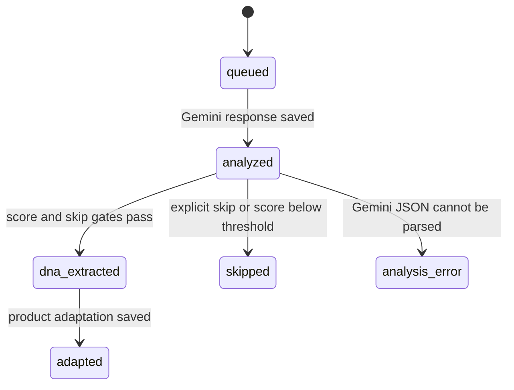

# `for_generating` Sheet Contract

`for_generating` is the interface between discovery and creative production. Column names are case-sensitive because n8n expressions and Google Sheets mappings refer to them directly.

Use the public [template sheet](https://docs.google.com/spreadsheets/d/15U44PZbhgFEWRrzOYqnybEk2km_1f6bmPaI0wi_-888/edit#gid=1839004881) as the canonical example.

## Input Columns

| Column | Required | Written by | Purpose |
| --- | --- | --- | --- |
| `shortcode` | Yes | Discovery or user | Stable unique key used by every update operation. |
| `gd_file_id` | Yes for `cp01` | Downloader or user | Google Drive file ID for the source video. The Gemini workflow downloads this file. |
| `status` | Yes | Discovery/workflows | Main pipeline state. A new creative-production candidate must start as `queued`. |
| `Shortlisted` | Yes for `cp01` | Discovery or user | Set to `Yes` to allow Gemini analysis. |
| `Original json file` | Recommended | Upstream analyzer | Detailed original-video breakdown used to preserve the visual and topic anchors during adaptation. |
| `url` | Recommended | Discovery or user | Original Instagram Reel URL for traceability. |
| `duration_seconds` | Optional | Discovery | Source metadata that helps auditing and comparison. |

The discovery module also writes metrics such as `like_count`, `comment_count`, `play_count`, and `ig_play_count`. Creative production does not require those fields after a row has been queued.

## Analysis and Adaptation Columns

| Column | Written by | Purpose |
| --- | --- | --- |
| `DNA_Extractor` | `cp01` | Gemini JSON containing creative DNA, language, duration, skip reason, AI-generation suitability, and `product_fit`. |
| `score` | `cp01` | Numeric `product_fit.score`. |
| `reason_to_skip` | `cp01` | Explicit skip cause or product-fit explanation. |
| `Adapter` | `cp02` | Product-adapted concept, source-fidelity anchors, script, and shot plan. |

## Seedance Columns

| Column | Written by | Purpose |
| --- | --- | --- |
| `final_prompt_seedance` | Seedance `cp03` | Validated JSON containing the Seedance prompt and creative brief. |
| `seedance_generation_status` | Seedance `cp03`/`cp04` | Branch-specific prompt and generation state. |
| `seedance_generation_note` | Seedance `cp03`/`cp04` | Validation details or generated prompt length. |
| `output_kie_seedance` | Seedance `cp04` | Result URL returned by Kie.ai. |
| `output_gd_seedance` | Seedance `cp04` | Final Google Drive link. |

## Kling Columns

| Column | Written by | Purpose |
| --- | --- | --- |
| `final_prompt_kling` | Kling `cp03` | Validated JSON containing the Kling prompt and creative brief. |
| `kling_generation_status` | Kling `cp03`/`cp04` | Branch-specific prompt and generation state. |
| `kling_generation_note` | Kling `cp03`/`cp04` | Validation details or generated prompt length. |
| `output_kie_kling` | Kling `cp04` | Result URL returned by Kie.ai. |
| `output_gd_kling` | Kling `cp04` | Final Google Drive link. |

## Main Status Flow

`analyzed` is normally transient because `cp01` immediately parses and scores the Gemini response. It remains useful when troubleshooting a failure between the two Google Sheets updates.

## Branch Statuses

Seedance uses:

- `seedance_prompt_generated`;
- `seedance_prompt_needs_review`;
- `seedance_prompt_parse_error`;
- `kie_result_ready`;
- `seedance_generated`.

Kling uses:

- `kling_prompt_generated`;
- `kling_prompt_needs_review`;
- `kling_prompt_parse_error`;
- `kie_result_ready`;
- `kling_generated`.

The main `status` remains `adapted` while either generation branch runs. This allows Seedance and Kling to operate independently on the same row without overwriting each other's progress.
