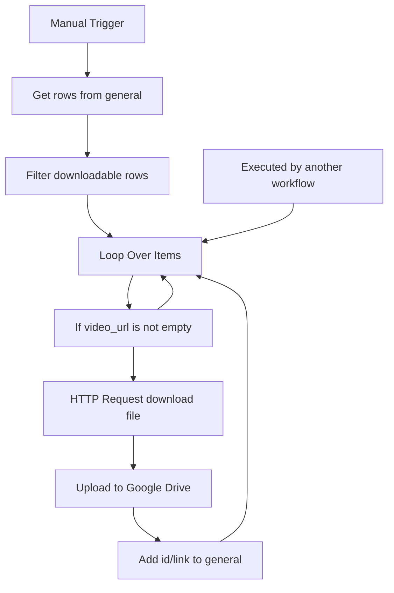

# IG Video Scrapper Download

Workflow file: `IG video sccrapper Download.json`

## Purpose

This helper workflow downloads Instagram video files from scraper-provided `video_url` values, uploads them to Google Drive, and writes the Drive link back to the `general` sheet.

It exists because Instagram media URLs returned by scrapers can expire quickly. Saving the file shortly after scraping preserves the source video for later creative analysis or generation.

## How It Is Triggered

The workflow supports two trigger modes:

1. Manual execution through `When clicking 'Execute workflow'`.
2. Execution by another workflow through `When Executed by Another Workflow`.

`wf01` and `wf02` call this workflow after scraping batches.

## Inputs

When called by another workflow, each input item should contain:

- `shortcode`
- `video_url`
- `status`
- `product_type`
- optionally `gd_file_id`

When run manually, the workflow loads rows from the `general` sheet and filters them before downloading.

## Main Flow



## Step-by-Step Logic

1. `When clicking 'Execute workflow'`
   Manual path. Starts the workflow and reads rows from `general`.

2. `Get row(s) in sheet`
   Reads all rows from the `general` sheet.

3. `Filter`
   Keeps only rows that are ready for download:

   - `gd_file_id` is empty;
   - `status` equals `scraped`;
   - `product_type` equals `clips`.

   This avoids downloading rows that are already saved, not scraped yet, or not Reels.

4. `When Executed by Another Workflow`
   Called by `wf01` or `wf02`. Uses passthrough input from the parent workflow.

5. `Loop Over Items`
   Processes videos one by one.

6. `If`
   Checks that `video_url` is not empty.

   - If `video_url` exists, continue to download.
   - If `video_url` is missing, skip the item and continue the loop.

7. `HTTP Request`
   Downloads the video as binary data from:

   ```js
   {{ $json.video_url }}
   ```

   The request uses browser-like headers:

   - `User-Agent`
   - `Referer`
   - `Accept`
   - `Range`

   Response format is set to `file`, and timeout is set to 60 seconds.

8. `Upload`
   Uploads the downloaded binary file to Google Drive.

   The imported workflow points to a specific Drive and folder. Replace these IDs after importing into another n8n workspace.

9. `Add id to table`
   Updates the matching row in `general` by `shortcode`:

   - `status = downloaded`
   - `gd_file_id = Google Drive file ID`
   - `link_to_gdrive = https://drive.google.com/file/d/{id}/view?usp=sharing`

## Outputs

### Google Drive

Stores the downloaded video file.

### Google Sheet: `general`

Receives:

| Column | Value |
| --- | --- |
| `status` | `downloaded` |
| `gd_file_id` | Uploaded Google Drive file ID |
| `link_to_gdrive` | Shareable Google Drive file URL |

## Operational Notes

- Run this workflow soon after scraping because `video_url` links can expire.
- The workflow only downloads rows where `product_type = clips`.
- If a row already has `gd_file_id`, the manual path skips it.
- If called from another workflow, make sure the parent workflow passes rows with `video_url`.
- Replace the Google Drive folder ID before publishing or reusing the workflow in another account.

