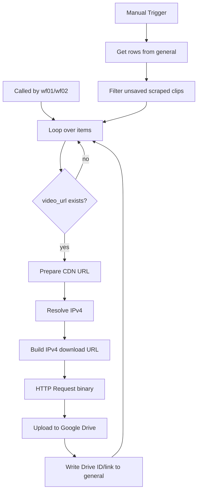

# IG Video Scrapper Download

Workflow file: `IG video sccrapper Download.json`

## Purpose

This shared helper downloads temporary Instagram video URLs, uploads the files to Google Drive, and writes the Drive metadata back to `general`.

Instagram CDN URLs can expire. The workflow should therefore run soon after `wf01` or `wf02` discovers a Reel.

## Triggers and inputs

The workflow supports:

1. manual execution, which loads candidates from `general`;
2. `When Executed by Another Workflow`, used by `wf01` and `wf02`.

Expected fields include `shortcode`, `video_url`, `status`, `product_type`, and optionally `gd_file_id`.

## Manual-path filters

A sheet row is eligible only when:

- `gd_file_id` is empty;
- `status = scraped`;
- `product_type = clips`.

The `If` node additionally skips any item whose `video_url` is empty.

## Main Flow

## CDN and IPv4 handling

### `Prepare CDN URL`

The node extracts the hostname from `video_url`. Hosts matching Instagram's dynamic `instagram.*.fna.fbcdn.net` form are normalized to `scontent.cdninstagram.com`; other hosts are preserved.

It outputs:

- `cdn_host`: hostname used for HTTP/TLS host handling;
- `cdn_url`: normalized source URL.

### `Resolve IPv4`

The workflow requests DNS A-record data for `cdn_host`.

### `Build IPv4 download URL`

The first valid IPv4 A record replaces only the hostname in the network URL. The original path and query string are preserved.

It outputs:

- `ipv4`;
- `download_url = https://{ipv4}{original_path_and_query}`.

If no IPv4 address is returned, the workflow throws an explicit error rather than silently uploading an invalid response.

### `HTTP Request`

The binary request uses `download_url` but sends the original `cdn_host` in the `Host` header, plus browser-like `User-Agent`, Instagram `Referer`, and `Accept` headers. Redirects are enabled, the response format is `file`, and timeout is 60 seconds.

This path avoids failures caused by an unusable IPv6 route while retaining the CDN hostname needed by the request.

## Outputs

### Google Drive

Stores the downloaded binary video.

### `general`

The row matching `shortcode` is updated with:

| Field | Value |
| --- | --- |
| `status` | `downloaded` |
| `gd_file_id` | Uploaded Drive file ID |
| `link_to_gdrive` | Drive view link for the uploaded file |

## Operational notes

- Parent workflows must pass a valid `video_url`.
- The manual path skips rows already containing `gd_file_id`.
- DNS/CDN changes can break direct-IP downloads; monitor download failures.
- Reconnect Google Sheets/Drive credentials and select the Drive/folder after import.
- Reconnect the Execute Sub-workflow references in `wf01` and `wf02` if the imported downloader ID changes.
