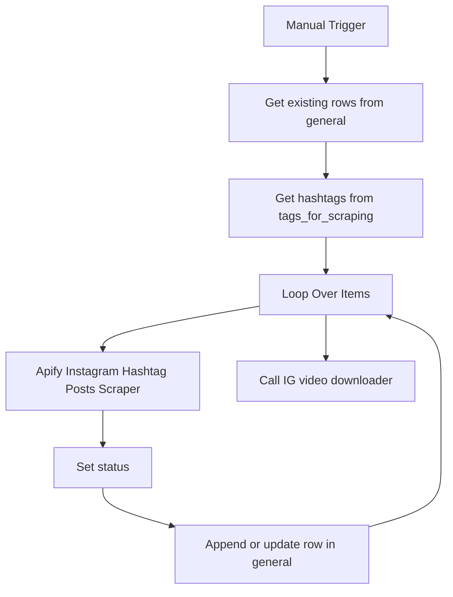

# wf01: IG Top Hashtags Scraping

Workflow file: `wf01 IG_tophashtags_scraping.json`

## Purpose

This workflow builds the initial Instagram Reels dataset from the top posts for a list of hashtags. It is designed as a backfill workflow: run it once at the beginning, or rerun it when you add a new hashtag set and want to collect a larger pool of already-proven content.

## Inputs

### Google Sheet: `tags_for_scraping`

The workflow reads rows from the `tags_for_scraping` sheet. Each row should contain a hashtag in the `tags` column.

Example:

| tags |
| --- |
| ai |
| productivity |
| studyhacks |

### Existing rows from `general`

Before scraping, the workflow also reads existing rows from the `general` sheet. This is used to preserve the current `status` of already-known Reels when a top hashtag scrape returns a Reel that is already in the database.

## Main Flow



## Step-by-Step Logic

1. `When clicking 'Execute workflow'`
   Starts the workflow manually.

2. `Get existing rows`
   Loads the existing `general` sheet rows so the workflow can keep the current status of posts that are already known.

3. `Get row(s) in sheet`
   Reads hashtags from `tags_for_scraping`.

4. `Loop Over Items`
   Processes hashtags one by one.

5. `Run an Actor and get dataset`
   Calls Apify Instagram Hashtag Posts Scraper:

   ```json
   {
     "hashtag": "{{ $json.tags }}",
     "max_items": 50,
     "scrape_type": "top"
   }
   ```

   The important setting is `scrape_type: top`, which asks Apify for top posts rather than recent posts.

6. `Set status`
   Checks whether each returned Reel already exists in `general`.

   - If the shortcode already exists and has a status, the workflow keeps that status.
   - If the shortcode is new, it sets `status` to `scraped`.

7. `Append or update row in sheet`
   Writes the scraped data to `general`, matching rows by `shortcode`.

8. `Call 'IG video sccrapper Download'`
   After each loop finishes, the workflow can call the helper downloader workflow to save video files to Google Drive and write Drive metadata back to `general`.

## Outputs

### Google Sheet: `general`

The workflow writes detailed Instagram post data, including:

- `shortcode`
- `url`
- `taken_at`
- `taken_at_timestamp`
- `scraped_at`
- `product_type`
- `media_type`
- `author`
- `caption`
- `hashtags`
- `mentions`
- `like_count`
- `comment_count`
- `play_count`
- `ig_play_count`
- `fb_play_count`
- `reshare_count`
- `video_url`
- `thumbnail_url`
- `duration_seconds`
- `status`

## When to Use It

Use this workflow when:

- setting up the pipeline for the first time;
- adding a new group of hashtags;
- rebuilding the initial seed dataset;
- collecting top-performing historical hashtag content.

This workflow is not optimized for daily discovery. For ongoing new-post collection, use `wf02`.

## Operational Notes

- The Apify call is configured for 50 top posts per hashtag.
- The workflow uses `appendOrUpdate`, so duplicate shortcodes update existing rows instead of creating duplicate rows.
- Status preservation matters because later workflows use `status` to avoid re-queueing already-selected Reels.
- The downloader should run soon after scraping because Instagram `video_url` values can expire.

