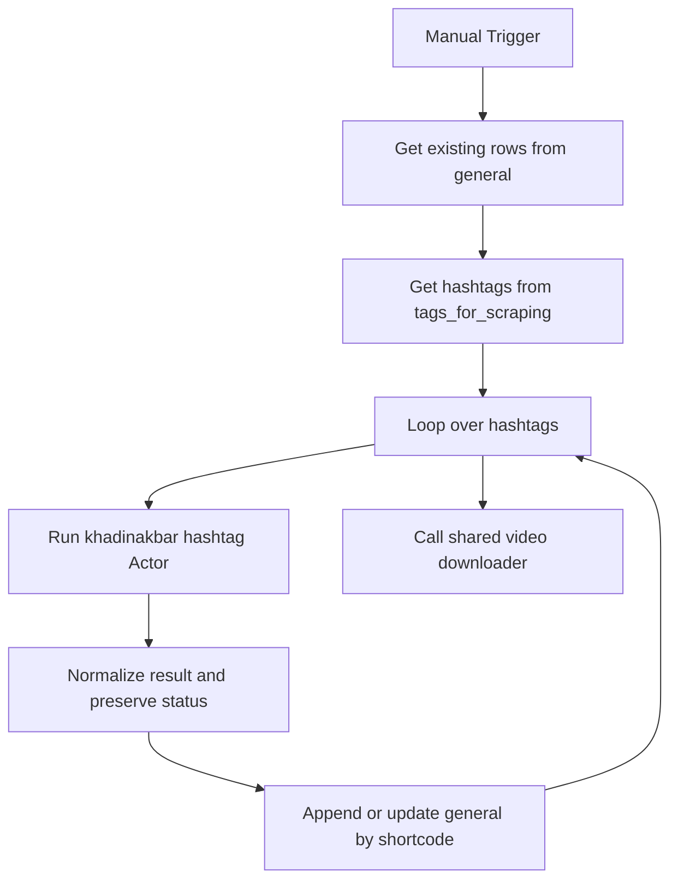

# wf01: IG Top Hashtags Scraping

Workflow file: `wf01 IG_tophashtags_scraping.json`

## Purpose

This is the manual seed workflow for creating the initial Instagram scope. Run it during setup, when adding a new hashtag group, or when intentionally rebuilding the seed set. Ongoing incremental discovery belongs to `wf02`.

`wf01` is intentionally manual and unpublished.

## Inputs

### `tags_for_scraping`

Each row supplies a hashtag in the `tags` column.

| tags |
| --- |
| ai |
| productivity |
| studyhacks |

### Existing rows from `general`

The workflow loads existing rows before scraping so an upsert does not erase a downstream status such as `downloaded` or `moved_to_top`.

## Main Flow



## Apify request

The workflow uses the same Actor and input contract as `wf02`:

- Actor ID: `XxaKfMpcnemfuNxSc`
- Actor: `khadinakbar/instagram-hashtag-scraper`

```json
{
  "datePosted": "last-week",
  "hashtags": ["{{ $json.tags }}"],
  "includeComments": false,
  "maxPostsPerHashtag": 50
}
```

The Actor is no longer configured with the old `scrape_type: top` contract. “Initial scope” describes the workflow's role, not a special Actor ranking mode: it collects the one-week scope returned by the same Actor used by `wf02`.

## Normalization and status preservation

The `Set status` Code node:

1. accepts Actor results returned directly or under `items`, `posts`, `data`, or `results`;
2. extracts `shortcode` directly or from an Instagram Reel/post/TV URL;
3. maps Actor-specific fields to the `general` sheet contract;
4. derives `taken_at_timestamp` from the posted date when needed;
5. preserves a non-empty status from an existing row with the same shortcode;
6. assigns `status = scraped` only when no previous status exists.

Rows are written with `appendOrUpdate`, matching on `shortcode`.

## Output fields

The `general` write includes identifiers, timestamps, author/caption metadata, hashtags/mentions, Instagram and Facebook metrics, video/thumbnail URLs, duration/dimensions/audio fields, partnership/tag/location metadata, and `status`.

## Downloader handoff

After the hashtag loop completes, the workflow calls `IG video sccrapper Download`. The helper downloads eligible Reel files before temporary Instagram CDN URLs expire, uploads them to Google Drive, and writes Drive metadata back to `general`.

## When to use wf01 vs wf02

Use `wf01` for:

- first-time seeding;
- a new hashtag group;
- an intentional manual reseed.

Use `wf02` for:

- recurring collection;
- append-only discovery;
- automatic rejection of known shortcodes.

## Operational notes

- The workflow has only a click trigger and should remain unpublished.
- Upserts can refresh source fields for an existing shortcode, but must preserve its workflow status.
- The maximum is 50 posts per hashtag for the last-week Actor window.
- After import, reconnect Sheets/Apify credentials, resource selections, and the child downloader workflow.
