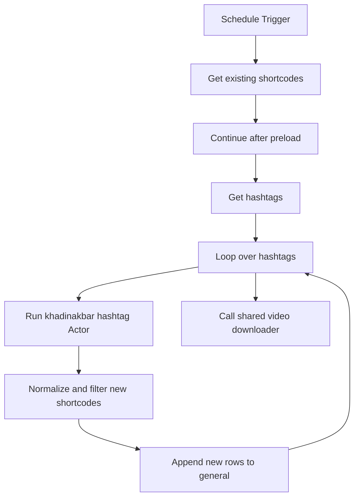

# wf02: IG Hashtags Scraping — Dedup Append Only

Workflow file: `wf02 IG_hashtags_scraping - dedup append only.json`

## Purpose

This is the scheduled incremental collector. It reads the same hashtag list as `wf01`, normalizes the Actor response, and appends only shortcodes that are not already known.

It never refreshes metrics for existing rows; `wf03` owns metric refreshes.

## Inputs

- `tags_for_scraping.tags`: monitored hashtags.
- `shortcode.shortcode`: lookup list of already-known posts.
- n8n global workflow static data: a supplementary shortcode cache.

The sheet preload is durable, inspectable source data. Static data supplements it and prevents repeats within and across executions, but should not be the only source of truth.

## Main Flow



## Schedule

The trigger runs every hour at minute 20. The effective timezone is the n8n instance/workflow timezone and should be confirmed after import.

## Apify request

- Actor ID: `XxaKfMpcnemfuNxSc`
- Actor: `khadinakbar/instagram-hashtag-scraper`

```json
{
  "datePosted": "last-week",
  "hashtags": ["{{ $json.tags }}"],
  "includeComments": false,
  "maxPostsPerHashtag": 50
}
```

## Normalization

`Filter new shortcodes` accepts direct rows and common wrappers (`items`, `posts`, `data`, `results`). It:

- extracts shortcode from `shortcode`, `code`, `shortCode`, or the URL;
- maps ID, URL, posted/scraped times, media/product type, author/caption, hashtags/mentions, metrics, video/thumbnail URLs, duration, partnership, location, and tagged-user information;
- derives a canonical Instagram Reel URL when only a shortcode is available;
- derives a Unix timestamp from the posted date when needed.

## Deduplication

The known set is built from:

1. the `shortcode` sheet;
2. `state.shortcodeCache`;
3. new shortcodes accepted earlier in the same run.

A row is discarded if:

- no shortcode can be derived; or
- the shortcode is already in the known set.

Accepted shortcodes are added to the set immediately, so duplicate Actor results in the same execution cannot be appended twice. The final set is saved back to `state.shortcodeCache`.

## Outputs

Only accepted rows reach `Append new row in sheet`. They are appended to `general` with:

```text
status = scraped
```

The node uses `append`, not `appendOrUpdate`. Existing rows are intentionally untouched.

The shared downloader is then called for newly collected data so expiring `video_url` values can be saved.

## Operational notes

- Keep the `shortcode` lookup synchronized with `general`; otherwise durable deduplication can become incomplete.
- Static data can become stale and may require clearing during a controlled reset.
- Changing `maxPostsPerHashtag` affects Apify cost and downstream download volume.
- Confirm schedule/timezone, credentials, sheet selections, and child-workflow reference after import.
