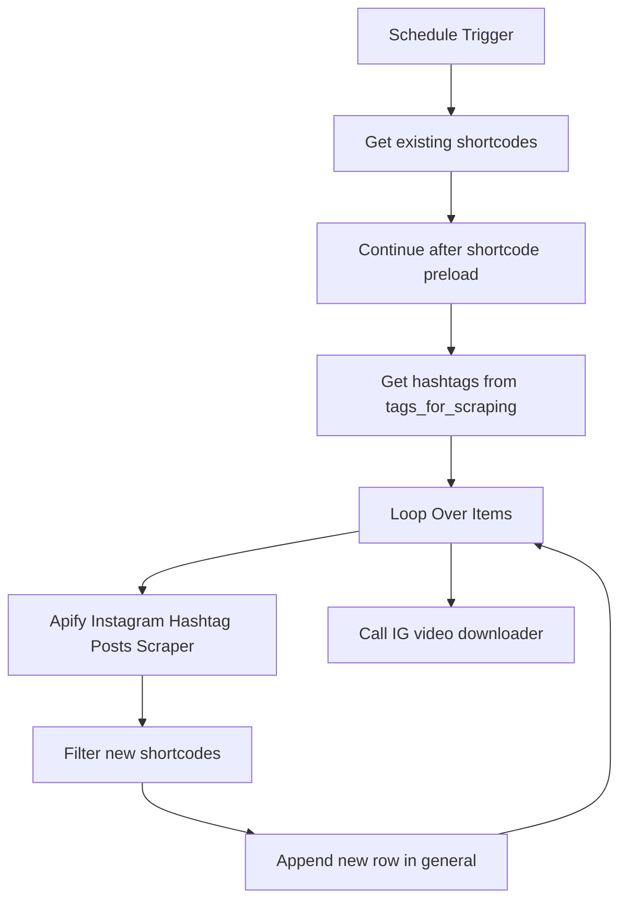

# wf02: IG Hashtags Scraping - Dedup Append Only

Workflow file: `wf02 IG_hashtags_scraping - dedup append only.json`

## Purpose

This workflow is the scheduled discovery workflow. It monitors the same hashtag list as `wf01`, but instead of pulling top posts, it pulls recent posts and appends only posts that are not already known.

Its job is to keep the `general` sheet growing with newly discovered Instagram Reels while avoiding duplicate rows.

## Inputs

### Google Sheet: `tags_for_scraping`

Contains the hashtags to monitor. The workflow reads the `tags` column.

### Google Sheet: `shortcode`

Contains already-known shortcodes. The workflow loads this sheet before scraping and uses it as a deduplication source.

### Workflow static data

The `Filter new shortcodes` Code node also uses n8n workflow static data as an in-run and cross-run shortcode cache:

```js
const state = $getWorkflowStaticData('global');
```

This reduces repeated appends inside the same workflow execution and helps keep the known-shortcode set warm between executions.

## Main Flow



## Step-by-Step Logic

1. `Schedule Trigger`
   Runs the workflow automatically. The imported workflow is configured with a scheduled trigger.

2. `Get existing shortcodes`
   Reads the `shortcode` sheet to preload known Reels.

3. `Continue after shortcode preload`
   Emits one control item so the workflow can continue after the shortcode preload.

4. `Get row(s) in sheet`
   Reads monitored hashtags from `tags_for_scraping`.

5. `Loop Over Items`
   Processes hashtags one by one.

6. `Run an Actor and get dataset`
   Calls Apify Instagram Hashtag Posts Scraper:

   ```json
   {
     "hashtag": "{{ $json.tags }}",
     "max_items": 50,
     "scrape_type": "recent"
   }
   ```

   The important setting is `scrape_type: recent`. This makes the workflow suitable for ongoing discovery rather than initial backfill.

7. `Filter new shortcodes`
   Builds a `Set` of known shortcodes from:

   - workflow static data;
   - the `Get existing shortcodes` sheet output;
   - new shortcodes seen earlier in the same execution.

   A returned post is allowed through only if:

   - it has a shortcode;
   - the shortcode is not already known.

8. `Append new row in sheet`
   Appends only new posts to `general`.

   Unlike `wf01`, this node uses `append`, not `appendOrUpdate`, because the workflow is intentionally append-only after deduplication.

9. `Call 'IG video sccrapper Download'`
   Calls the helper downloader workflow to save videos while `video_url` is still valid.

## Outputs

### Google Sheet: `general`

Newly discovered posts are appended with full scraper metadata and:

```text
status = scraped
```

## Deduplication Behavior

The deduplication key is `shortcode`.

If Apify returns a post whose shortcode already exists in the loaded shortcode list or static cache, it is skipped. If the shortcode is new, it is appended and immediately added to the in-memory set so the same execution cannot append it twice.

## When to Use It

Use this workflow as the regular scheduled scraper after `wf01` has seeded the initial database.

It is the best workflow for:

- discovering new posts from tracked hashtags;
- keeping the dataset fresh;
- avoiding duplicate rows in `general`;
- feeding new candidates into the metric refresh and daily ranking workflows.

## Operational Notes

- If the `shortcode` sheet is not updated from `general`, deduplication can become incomplete. Keep the lookup sheet in sync with the main data.
- If you want more or fewer posts per hashtag, change `max_items` in the Apify node.
- If the workflow static data cache gets stale, clear static data or rely on the sheet preload as the source of truth.

