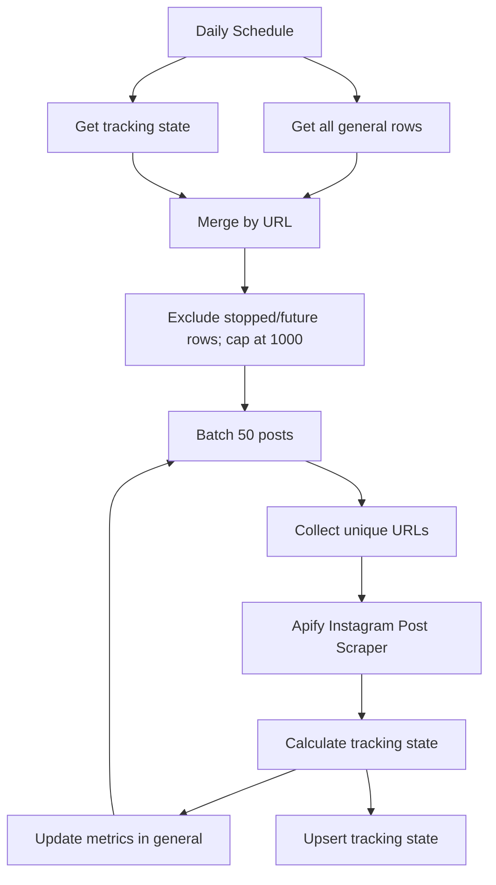

# wf03: IG Top Hashtags Scraping — Update Metrics

Workflow file: `wf03 IG_tophashtags_scraping_UPDATE_Metrics.json`

## Purpose

This workflow refreshes Instagram metrics only for posts that are still eligible for tracking. Its paid-request control is based exclusively on view growth.

A post is permanently removed from future Apify traversal when its views grow by less than 10% over a completed 72-hour window.

## Inputs

### Google Sheet: `general`

The workflow reads all rows and uses `url` as the main tracking key. It later updates current Instagram metrics in the matching sheet row.

### n8n Data Table: `IG Metrics Tracking State`

Core fields:

| Field | Type | Purpose |
| --- | --- | --- |
| `url` | string | Upsert/join key |
| `shortcode` | string | Instagram shortcode |
| `tracking_status` | string | `active` or `stopped_stagnant` |
| `last_checked_at` | dateTime | Last successful Apify refresh |
| `last_views` | number | Latest view count |
| `delta_views` | number | Change since the prior refresh |
| `next_check_at` | dateTime | Earliest next paid check |
| `window_started_at` | dateTime | Start of the 72-hour window |
| `window_start_views` | number | Views at window start |
| `growth_3d_pct` | number | Current window growth ratio |
| `stopped_at` | dateTime | Permanent-stop time |
| `stop_reason` | string | `views_growth_below_10pct_over_72h` |

Legacy `last_likes`, `last_comments`, deltas, `last_growth_at`, and `no_growth_checks` are still refreshed for compatibility/diagnostics, but do not decide whether tracking stops.

## Main Flow



## Schedule and due selection

The trigger is configured for hour 01:20 in the n8n workflow timezone.

`Code: Filter due posts` applies these rules before Apify:

1. Exclude `tracking_status = stopped_stagnant` permanently.
2. Exclude rows whose `next_check_at` is in the future.
3. Split due rows into tracked and untracked groups.
4. Put tracked due rows first.
5. Limit the combined result to 1,000 posts per execution.

Active rows set their next check to one day later, so the same tracked post is checked at most daily under normal operation.

## Batching and Apify request

`Loop Over Items` batches up to 50 rows. `Code: Collect URLs` removes empty and duplicate URLs inside the batch.

The workflow calls `apify/instagram-post-scraper` with:

```js
{
  dataDetailLevel: "detailedData",
  resultsLimit: 50,
  skipPinnedPosts: false,
  username: urls
}
```

## View metric

The stop decision uses only views. Fresh views are the maximum available value among:

```text
videoPlayCount
videoViewCount
play_count
ig_play_count
views
```

Likes and comments do not affect the 10% threshold.

## 72-hour window logic

Configuration:

```js
ACTIVE_INTERVAL_DAYS = 1
WINDOW_HOURS = 72
MIN_WINDOW_GROWTH_PCT = 0.10
```

For a new tracking row:

```text
window_started_at = now
window_start_views = current views
tracking_status = active
next_check_at = now + 1 day
```

While the window is younger than 72 hours, the post remains active regardless of interim growth.

Current window growth is:

```js
growth_3d_pct =
  max(0, current_views - window_start_views) / window_start_views
```

If the window started at zero views, any positive current view count is treated as 100% growth.

When the window reaches 72 hours:

- If growth is at least 10%, the post remains `active`, the window restarts at the current time/current views, and `growth_3d_pct` resets to zero.
- If growth is below 10%, the post becomes `stopped_stagnant`, `next_check_at` becomes null, `stopped_at` is set, and the stop reason is recorded.

A stopped row is excluded before every future paid Apify request. It does not automatically reactivate.

## Metric/state outputs

For each successful scrape result, the workflow:

- updates fresh metrics in `general`;
- upserts the tracking row;
- stores last values and per-check deltas;
- stores window state and permanent-stop fields.

URL matching is normalized by removing query strings, fragments, and trailing slashes; shortcode matching is used as a fallback when Apify returns a different canonical URL form.

## Capacity and cost behavior

- Maximum due posts per run: 1,000.
- Maximum URLs per Actor batch: 50.
- Tracked due rows are prioritized over new/untracked rows.
- Stopped and not-yet-due rows consume no Apify request in that run.
- If more than 1,000 rows are due, overflow waits for a later execution.

## Verified scenario

An isolated test confirmed:

- 8% growth after 72 hours becomes `stopped_stagnant`;
- 20% growth remains active and starts a new window;
- stopped rows are excluded before Apify;
- future-due rows are excluded before Apify.

## Operational notes

- The workflow is published; changing the draft alone does not change the active production version.
- The 10% comparison is a ratio (`0.10`), while documentation/UI may display it as 10%.
- A permanent stop currently requires manual state change if reactivation is ever desired.
- Confirm Data Table field types, schedule timezone, credentials, and resource selections after import.
