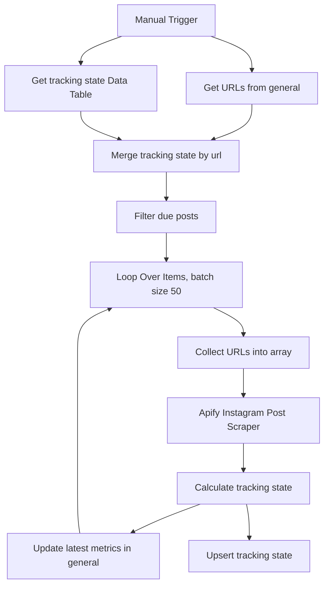

# wf03: IG Top Hashtags Scraping - Update Metrics

Workflow file: `wf03 IG_tophashtags_scraping_UPDATE_Metrics.json`

## Purpose

This workflow refreshes metrics for posts already stored in the `general` sheet. It is designed to detect growth over time while reducing unnecessary Apify usage.

Instead of scraping every saved URL every day, it keeps a native n8n Data Table with tracking state. Posts that are still growing are checked frequently. Posts that stop growing are moved into slower recheck intervals.

This is the workflow that catches delayed breakout posts: a Reel may enter the database with low views, then grow significantly several days later.

## Inputs

### Google Sheet: `general`

The workflow reads URLs from the `general` sheet. In the imported workflow, the Google Sheets node reads the `C1:C1000` range, where column `C` contains post URLs.

### n8n Data Table: `IG Metrics Tracking State`

This table stores refresh state for each URL.

Required columns:

| Column | Type | Purpose |
| --- | --- | --- |
| `url` | string | Upsert key and match key. |
| `shortcode` | string | Instagram shortcode. |
| `tracking_status` | string | `active`, `cooldown`, or `paused_no_growth`. |
| `last_checked_at` | dateTime | Last metric refresh time. |
| `last_growth_at` | dateTime | Last time growth was detected. |
| `last_views` | number | Previous view count. |
| `last_likes` | number | Previous like count. |
| `last_comments` | number | Previous comment count. |
| `delta_views` | number | View delta from the previous check. |
| `delta_likes` | number | Like delta from the previous check. |
| `delta_comments` | number | Comment delta from the previous check. |
| `no_growth_checks` | number | Consecutive no-growth checks. |
| `next_check_at` | dateTime | Next allowed refresh time. |

## Main Flow



## Step-by-Step Logic

1. `When clicking 'Execute workflow'`
   Starts the refresh manually. You can replace this with a schedule if you want automated metric refreshes.

2. `Get row(s) in sheet`
   Reads saved post URLs from the `general` sheet.

3. `Get tracking state`
   Reads all rows from the `IG Metrics Tracking State` Data Table.

4. `Merge tracking state`
   Enriches Google Sheet rows with Data Table state by matching on `url`.

5. `Code: Filter due posts`
   Allows only posts that should be refreshed now.

   A post passes if:

   - `next_check_at` is empty;
   - `next_check_at` cannot be parsed;
   - `next_check_at` is earlier than or equal to the current time.

   A post is skipped if `next_check_at` is still in the future.

6. `Loop Over Items`
   Processes due posts in batches of 50.

7. `Code: Collect URLs`
   Converts a batch of individual n8n items into a single item with:

   ```json
   {
     "urls": ["https://www.instagram.com/reel/...", "..."]
   }
   ```

   This lets the Apify Post Scraper process up to 50 URLs in one actor run.

8. `Run an Actor and get dataset`
   Calls Apify Instagram Post Scraper:

   ```js
   JSON.stringify({
     dataDetailLevel: "detailedData",
     resultsLimit: 50,
     skipPinnedPosts: false,
     username: $json.urls
   })
   ```

   The Apify actor accepts post URLs in the `username` array.

9. `Code: Calculate tracking state`
   Compares fresh Apify metrics against previous Data Table state.

   It calculates:

   - `last_views`
   - `last_likes`
   - `last_comments`
   - `delta_views`
   - `delta_likes`
   - `delta_comments`
   - `no_growth_checks`
   - `tracking_status`
   - `next_check_at`

10. `Update row in sheet`
    Updates latest visible metrics in `general`, matching by shortcode:

    - `like_count`
    - `comment_count`
    - `play_count`

11. `Upsert tracking state`
    Writes the internal refresh state back to the `IG Metrics Tracking State` Data Table.

## Tracking Status Logic

The workflow uses three statuses:

| Status | Meaning | Next check |
| --- | --- | --- |
| `active` | New post or post showed metric growth. | 1 day later |
| `cooldown` | No growth, but not enough no-growth checks to pause. | 2 days later |
| `paused_no_growth` | No growth for 3 consecutive checks. | 7 days later |

The default configuration is in the `Code: Calculate tracking state` node:

```js
const CFG = {
  ACTIVE_INTERVAL_DAYS: 1,
  COOLDOWN_INTERVAL_DAYS: 2,
  PAUSED_INTERVAL_DAYS: 7,
  NO_GROWTH_CHECKS_TO_PAUSE: 3,
};
```

## Growth Detection

Growth is detected if any of these metrics increased:

- views;
- likes;
- comments.

If a post has no previous state, it is treated as growing/new and starts as `active`.

## Outputs

### Google Sheet: `general`

Receives updated latest metrics.

### n8n Data Table: `IG Metrics Tracking State`

Receives the complete refresh state used to decide future scraping.

## Operational Notes

- This workflow is the main Apify cost-control layer.
- If the Data Table is empty, all URLs pass through once and create initial state.
- If a post has `next_check_at` in the future, it is not sent to Apify.
- Use a separate Data Table for this workflow instead of reusing the `wf04` scoring snapshot table.

