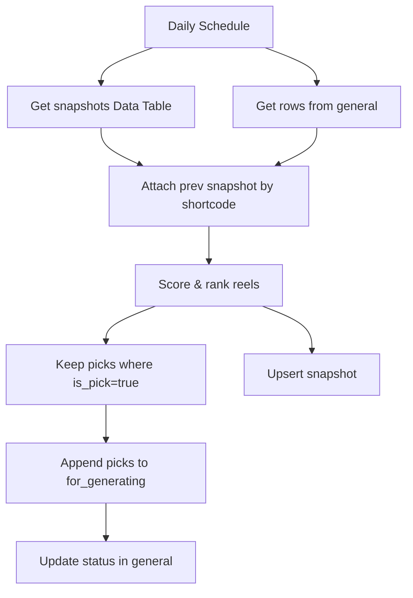

# wf04: Daily Top Reels

Workflow file: `wf04 Daily_Top_Reels.json`

## Purpose

This workflow selects the strongest daily creative candidates from the `general` sheet and appends them to the `for_generating` sheet.

It does not scrape Instagram directly. It ranks already-collected Reels using current metrics, previous snapshot metrics, engagement quality, recency, and momentum.

## Inputs

### Google Sheet: `general`

The workflow reads all current scraped rows from `general`.

Important fields:

- `shortcode`
- `url`
- `product_type`
- `taken_at`
- `taken_at_timestamp`
- `like_count`
- `comment_count`
- `play_count`
- `ig_play_count`
- `reshare_count`
- `duration_seconds`
- `gd_file_id`
- `link_to_gdrive`
- `status`

### n8n Data Table: daily snapshot table

The workflow reads previous snapshots from a Data Table and joins them to current rows by `shortcode`.

The workflow expects fields such as:

- `shortcode`
- `prev_views`
- `prev_likes`
- `prev_seen_ts`

The imported workflow contains a sticky note with setup instructions for mapping snapshot fields.

## Main Flow



## Step-by-Step Logic

1. `Daily 09:00`
   Scheduled trigger. In the imported workflow, the trigger is configured for a daily run.

2. `Get snapshots`
   Reads previous metrics from the Data Table.

3. `Get row(s) in sheet`
   Reads the current `general` sheet.

4. `Attach prev snapshot`
   Merges current rows with previous snapshot data by `shortcode`.

5. `Score & rank reels`
   Calculates quality, recency, momentum, and a final score for each eligible Reel.

6. `Keep picks (is_pick)`
   Keeps only rows where:

   ```js
   is_pick === true
   ```

7. `Append row in sheet`
   Appends selected rows to `for_generating` with:

   ```text
   status = queued
   ```

8. `Update status`
   Updates the matching row in `general`:

   ```text
   status = moved_to_top
   ```

   This prevents the same Reel from being selected again as a daily pick.

9. `Upsert snapshot`
   Writes the latest snapshot metrics back to the Data Table so tomorrow's run can calculate momentum.

## Scoring Logic

The `Score & rank reels` node contains the ranking configuration:

```js
const CFG = {
  MIN_VIEWS:      5000,
  MIN_LIKE_RATE:  0.01,
  HALF_LIFE_DAYS: 14,
  W_VIEWS:        0.30,
  W_LIKE:         0.30,
  W_ENG:          0.20,
  W_RECENCY:      0.20,
  MOMENTUM_PCT:   0.20,
  MOMENTUM_BONUS: 0.10,
  TOP_N:          5,
  ADDED_FIELD:    'status',
  ADDED_VALUE:    'moved_to_top',
};
```

## Eligibility Gates

A row must pass these gates:

1. `product_type` must be `clips`.
2. Views must be at least `MIN_VIEWS`.
3. Like rate must be at least `MIN_LIKE_RATE`.

Views are calculated as:

```js
Math.max(play_count, ig_play_count)
```

Like rate:

```js
likes / views
```

Engagement rate:

```js
(likes + comments + shares) / views
```

## Recency

The workflow calculates the Reel age from `taken_at` or `taken_at_timestamp`, then applies exponential decay:

```js
recency = Math.exp(-ageDays / HALF_LIFE_DAYS)
```

With the default half-life of 14 days, newer Reels get a higher recency component.

## Percentile Scoring

For all eligible rows, the workflow calculates percentile ranks for:

- views;
- like rate;
- engagement rate.

The final score is:

```text
score =
  0.30 * views percentile
  + 0.30 * like-rate percentile
  + 0.20 * engagement-rate percentile
  + 0.20 * recency
  + momentum bonus
```

## Momentum

Momentum is based on view growth compared with the previous snapshot.

A Reel gets `momentum = true` if:

```text
current views increased by at least 20% vs previous views
```

Momentum adds `0.10` to the final score by default.

## Outputs

### Google Sheet: `for_generating`

Receives daily picks with:

- `shortcode`
- `url`
- `scraped_at`
- `taken_at_timestamp`
- `caption`
- `like_count`
- `comment_count`
- `play_count`
- `ig_play_count`
- `duration_seconds`
- `gd_file_id`
- `link_to_gdrive`
- `status = queued`

### Google Sheet: `general`

Selected rows are marked:

```text
status = moved_to_top
```

### n8n Data Table

Receives updated snapshot data for future momentum calculations.

## Tuning

Change these values in `Score & rank reels`:

- `TOP_N` to pick more or fewer Reels per day.
- `MIN_VIEWS` to widen or narrow the candidate pool.
- `MIN_LIKE_RATE` to reduce low-quality high-view videos.
- `MOMENTUM_PCT` to make momentum easier or harder to trigger.
- `W_*` weights to change ranking priorities.

