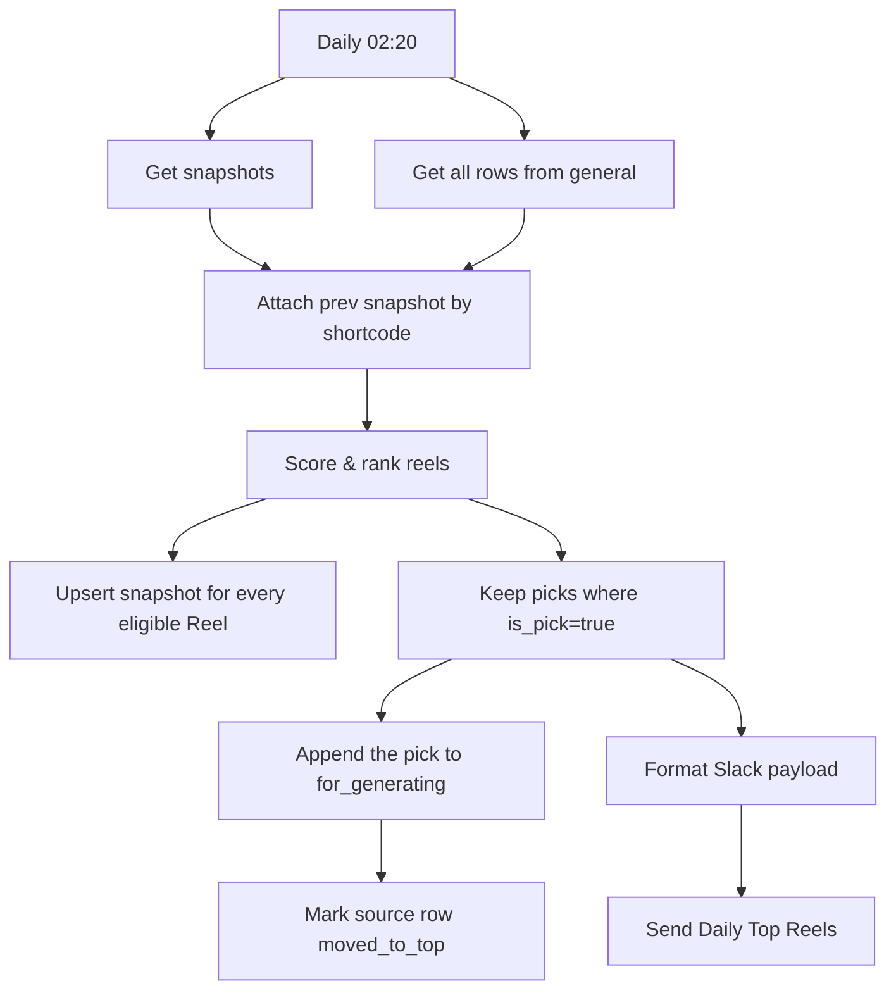

# wf04: Daily Top Reels

Workflow file: `wf04 Daily_Top_Reels.json`

## Purpose

This workflow selects the strongest daily creative candidates from the `general` sheet, appends the selected rows to `for_generating`, marks them as used in `general`, and sends the same picks to Slack.

It does not scrape Instagram. It ranks already-collected Reels using reach, engagement quality, recency, and—when the snapshot contract is working—momentum.

## Inputs

### Google Sheet: `general`

The workflow reads all current rows. Ranking uses these fields:

- `shortcode`, `url`, `author`, `caption`
- `product_type`
- `taken_at`, `taken_at_timestamp`
- `like_count`, `comment_count`, `reshare_count`
- `play_count`, `ig_play_count`
- `duration_seconds`, `gd_file_id`, `link_to_gdrive`
- `status`

### n8n Data Table: snapshot table

`Get snapshots` reads previous measurements and `Attach prev snapshot` joins them to current rows by `shortcode`.

The scoring code expects:

- `prev_views`
- `prev_likes`
- `prev_seen_ts`

These fields are used only for momentum, deltas, velocity, and the `new / momentum / tracked` flag.

## Main Flow



The trigger is configured for 02:20. The schedule time follows the n8n instance/workflow timezone. Confirm it after import.

## Eligibility: what enters the scoring pool

A row is excluded before scoring unless all conditions pass:

1. `product_type === "clips"`.
2. `views >= 10,000`.
3. `like_rate >= 0.01` (at least 1%).

Views are:

```js
views = Math.max(play_count, ig_play_count)
```

Missing or non-numeric metrics are treated as zero.

Like rate is:

```js
like_rate = like_count / views
```

Engagement rate is:

```js
eng_rate = (like_count + comment_count + reshare_count) / views
```

Only rows that pass these gates participate in percentile calculation, ranking, snapshot updates, and possible selection.

## Recency

The workflow parses `taken_at` first and falls back to `taken_at_timestamp`. It accepts Unix epoch seconds and ISO timestamps.

```js
age_days = (now - published_at) / 86_400_000
recency = Math.exp(-age_days / 14)
```

Despite the configuration name `HALF_LIFE_DAYS`, the implemented formula is an exponential time constant: at 14 days the component is approximately 0.368, not 0.5. An invalid/missing date gets a very old fallback age and therefore an almost-zero recency score.

## Percentiles and final score

Within the eligible pool, the workflow calculates midrank percentiles for:

- views;
- like rate;
- engagement rate.

Ties receive the average rank. The implemented score is:

```text
score =
  0.30 * views_percentile
  + 0.30 * like_rate_percentile
  + 0.20 * engagement_rate_percentile
  + 0.20 * recency
  + (momentum ? 0.10 : 0)
```

Candidates are sorted from highest score to lowest and receive `rank = 1, 2, 3, ...`.

## Momentum fields

When `prev_views`, `prev_likes`, and `prev_seen_ts` are present:

```text
d_views = current_views - prev_views
d_likes = current_likes - prev_likes
velocity = d_views / max(days_since_prev_snapshot, 1)
grew_pct = d_views / prev_views
momentum = grew_pct >= 20%
```

The flag shown in Slack is:

- `new`: no previous view snapshot;
- `momentum`: previous snapshot exists and views grew by at least 20%;
- `tracked`: previous snapshot exists but the momentum threshold was not met.

## Selection: what becomes a daily pick

The default limit is `TOP_N = 5`.

After ranking, a row becomes a pick only when:

```js
status !== 'moved_to_top' && fewer_than_5_new_picks_have_been_selected
```

Important details:

- Already-used rows remain in the eligible scoring pool. They still affect percentiles and still receive snapshot updates.
- Already-used rows cannot consume one of the five pick slots.
- The workflow walks the sorted list until it finds up to five not-yet-used rows.
- If fewer than five eligible unused rows exist, fewer than five picks are produced.
- `Keep picks (is_pick)` is the single gate for both `for_generating` and Slack. Therefore the intended set sent to Slack is exactly the same set selected for the table.

## What is written where

### Snapshot Data Table

Every eligible Reel—not only the top five—is sent from `Score & rank reels` to `Upsert snapshot`. This keeps the eligible comparison pool updated for the next run.

The scoring node prepares:

- `snap_shortcode`
- `snap_views`
- `snap_likes`
- `snap_seen_ts`

### Google Sheet: `for_generating`

Only `is_pick = true` rows are appended. The output includes:

- `shortcode`, `url`
- `scraped_at`, `taken_at_timestamp`
- `caption`
- `like_count`, `comment_count`
- `play_count`, `ig_play_count`
- `duration_seconds`
- `gd_file_id`, `link_to_gdrive`
- `status = queued`

### Google Sheet: `general`

After a successful append to `for_generating`, the matching source row is updated by `shortcode`:

```text
status = moved_to_top
```

This is the repeat-selection guard used on later days.

### Slack

Every row that passes `Keep picks (is_pick)` also enters `Format Slack payload` and `Send Daily Top Reels`.

Each message contains:

- rank;
- author and shortcode;
- score and flag;
- views, likes, and like rate;
- shortened caption when present;
- Instagram link;
- Google Drive link when present.

The Slack payload is text/Block Kit without the Instagram `thumbnail_url` image block. Instagram thumbnail URLs were unstable and caused Slack `invalid_blocks` errors.

The table/status branch and Slack branch run from the same pick output. A failure in one external destination should be reviewed separately; the workflow does not implement a transactional rollback across Google Sheets and Slack.

## Current snapshot limitation

The current scoring code expects joined fields named `prev_views`, `prev_likes`, and `prev_seen_ts`. The currently configured snapshot write maps source metric field names instead of reliably writing these `prev_*` aliases.

In the audited execution, all eligible candidates were therefore classified as `new`. Consequences:

- reach, like-rate, engagement, and recency scoring still work;
- top-five selection and Slack/table routing still work;
- the 0.10 momentum bonus is effectively unavailable;
- `d_views`, `velocity`, and momentum flags are not reliable.

Do not describe momentum as operational until the snapshot read/write schema is aligned and verified on two consecutive runs.

## Tuning

Edit `CFG` in `Score & rank reels`:

| Setting | Current value | Effect |
| --- | ---: | --- |
| `MIN_VIEWS` | 10,000 | Minimum reach gate |
| `MIN_LIKE_RATE` | 0.01 | Minimum like-rate gate |
| `HALF_LIFE_DAYS` | 14 | Recency decay denominator |
| `W_VIEWS` | 0.30 | Views percentile weight |
| `W_LIKE` | 0.30 | Like-rate percentile weight |
| `W_ENG` | 0.20 | Engagement percentile weight |
| `W_RECENCY` | 0.20 | Recency weight |
| `MOMENTUM_PCT` | 0.20 | Required view growth for momentum |
| `MOMENTUM_BONUS` | 0.10 | Score bonus |
| `TOP_N` | 5 | Maximum daily picks |

## Import checklist

- Reconnect Google Sheets and Slack credentials.
- Select `general`, `for_generating`, and the snapshot Data Table.
- Confirm the Slack channel.
- Confirm the schedule timezone.
- Fix and verify the snapshot alias contract before relying on momentum.
