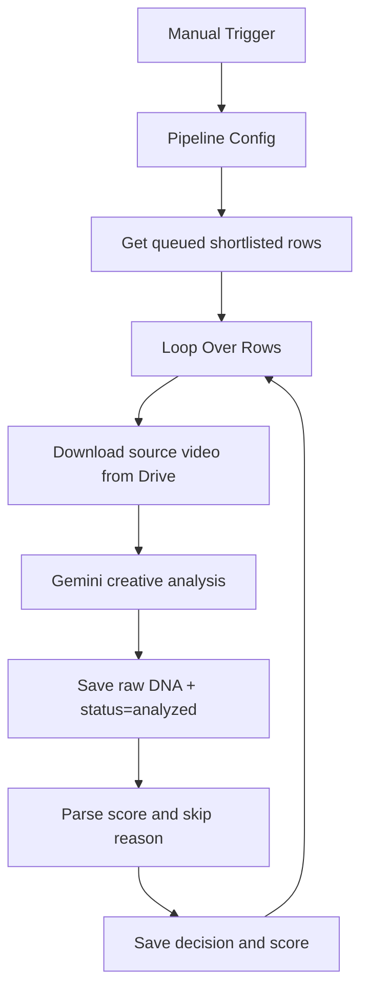

# cp01: Gemini Creative DNA Extractor

Workflow file: [`cp01-gemini-dna-extractor.json`](cp01-gemini-dna-extractor.json)

## Purpose

This workflow analyzes shortlisted source videos with Gemini. It extracts a reusable creative pattern, checks language, duration, cultural portability, product relevance, and AI-video feasibility, then decides whether the video should continue to product adaptation.

The workflow does not generate a new script or video. Its output is the structured creative DNA and a deterministic accept/skip decision stored in `for_generating`.

## Inputs

The Google Sheets node reads rows where:

```text
Shortlisted = Yes
status = queued
```

Required fields:

- `shortcode`: unique row key;
- `gd_file_id`: Google Drive ID of the source video;
- `status`;
- `Shortlisted`.

`Original json file`, source URL, caption, duration, and engagement metrics are useful for later steps but are not required to download the video.

## Configuration

Edit `Pipeline Config` before running. The Gemini prompt receives the complete configuration object.

Important scoring fields:

```js
scoring: {
  allowed_languages: ["en"],
  max_source_duration_sec: 60,
  target_video_duration_sec: 15,
  min_product_fit_score: 0.60,
  min_ai_video_generation_score: 0.60,
  reject_local_or_cultural_concepts: true
}
```

The default `product` object describes Speechify. Replace it to reuse the workflow for another product.

## Main Flow



## Step-by-Step Logic

1. `Pipeline Config` exposes product context, market settings, score gates, target duration, and generation model IDs.
2. `Get generated rows` reads only shortlisted rows in `queued` state.
3. `Loop Over Rows` processes videos one at a time.
4. `HTTP Request` downloads the video with `gd_file_id` through the connected Google Drive credential.
5. `Classify visible text with Gemini` uses `models/gemini-2.5-flash` to return JSON with format, mechanic, hook, language, duration, market fit, adaptation notes, AI-generation score, and product-fit score.
6. `Save text gate result` stores the raw JSON in `DNA_Extractor` and temporarily sets `status=analyzed`.
7. `DNA_Extractor` removes Markdown fences, parses the response, applies `min_product_fit_score`, and respects explicit Gemini skip reasons.
8. `add score` writes the final score, reason, and main status by matching `shortcode`.

## Decision Logic

The final status is:

| Status | Condition |
| --- | --- |
| `dna_extracted` | No explicit skip reason and `product_fit.score >= min_product_fit_score`. |
| `skipped` | Gemini returned a skip reason or the product-fit score is below the configured threshold. |
| `analysis_error` | Gemini output could not be parsed as JSON. |

Possible skip causes include unsupported language, excessive duration, inability to compress the concept, weak product fit, weak AI-generation fit, music/dance dependency, local cultural dependency, or unclear creative structure.

## Outputs

The workflow updates:

- `DNA_Extractor`;
- `score`;
- `reason_to_skip`;
- `status`.

Only rows ending in `dna_extracted` are eligible for `cp02`.

## Credentials

- `Google Sheets account`
- `Google Drive account`
- `Google Gemini API account`

Reconnect all three after importing the workflow.

## Operational Notes

- The manual trigger is intentional. Replace it with a schedule, webhook, or sub-workflow trigger after testing.
- A public template spreadsheet is configured by default. Make a private copy before processing private videos.
- Changing the product in only this workflow is not enough; keep the `Pipeline Config` values consistent across all six workflows.
