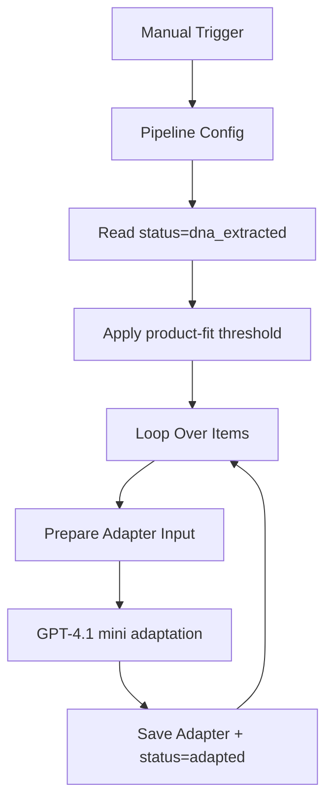

# cp02: Product Adapter

Workflow file: [`cp02-product-adapter.json`](cp02-product-adapter.json)

## Purpose

This workflow converts accepted creative DNA into a product-specific 15-second concept while preserving the source video's reusable mechanic, topic anchor, speaker, setting, camera style, pacing, and emotional arc.

It deliberately separates adaptation from prompt generation. Seedance and Kling can therefore receive different prompt formats from the same adapted concept.

## Inputs

The workflow reads `for_generating` rows where:

```text
status = dna_extracted
```

Important fields:

- `shortcode`;
- `score`;
- `DNA_Extractor`;
- `Original json file`;
- source URL and metadata for traceability.

`Original json file` is strongly recommended. Without the original breakdown, the Adapter has less reliable information about the speaker, location, camera, and source dialogue.

## Eligibility Gate

The `Filter` node checks:

```js
score >= $('Pipeline Config').first().json.scoring.min_product_fit_score
```

This repeats the main score gate defensively in case sheet rows are changed manually between `cp01` and `cp02`.

## Main Flow



## Step-by-Step Logic

1. `Pipeline Config` defines the product, audience, value propositions, markets, and production constraints.
2. `Get row(s) in sheet` selects accepted DNA rows.
3. `Filter` confirms that the score still meets the configured threshold.
4. `Loop Over Items` processes one row at a time.
5. `Prepare Adapter Input` parses the original analysis and creative DNA, compacts long arrays, and creates a canonical visual anchor.
6. `Message a model` uses `gpt-4.1-mini` to produce valid JSON with source fidelity, visual anchor, adapted concept, hook, 15-second script, shot plan, production notes, and exclusions.
7. `Add adapted information` stores the model output in `Adapter` and sets `status=adapted`.

## Source-Fidelity Rules

The workflow tells the model to preserve, when available:

- speaker count, identity, and observed characteristics;
- location and interior/background;
- selfie, talking-head, street-interview, or other camera format;
- source topic when relevant to the configured product;
- pacing, viral mechanic, and emotional arc.

It also avoids asking video models to render readable UI, screenshots, captions, title cards, or book/document text. Those elements should be added in post-production.

## Outputs

| Column | Value |
| --- | --- |
| `Adapter` | JSON returned by the adaptation model. |
| `status` | `adapted` |

An adapted row can proceed to the Seedance branch, the Kling branch, or both.

## Credentials

- `Google Sheets account`
- `OpenAI API account`

## Operational Notes

- Keep `Pipeline Config` synchronized with `cp01` and both prompt generators.
- The workflow uses `appendOrUpdate` matched by `shortcode`, so it updates the existing row rather than creating a duplicate.
- The manual trigger can be replaced without changing the downstream logic.
