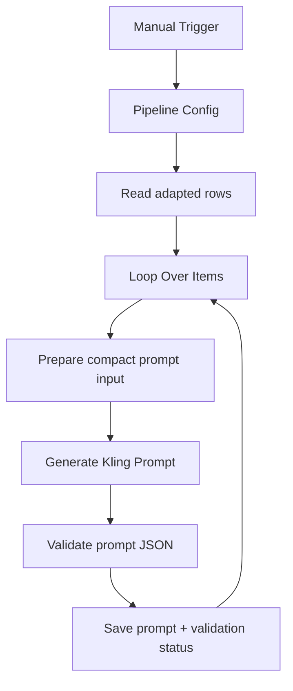

# cp03: Kling Prompt Generator

Workflow file: [`cp03-kling-prompt-generator.json`](cp03-kling-prompt-generator.json)

## Purpose

This workflow converts an adapted concept into a concise, literal Kling prompt. Compared with the Seedance branch, it places stronger restrictions on interfaces, screen close-ups, readable text, complex choreography, and long dialogue.

It generates and validates prompts only; video generation happens in `cp04`.

## Inputs

The Google Sheets node reads rows where:

```text
status = adapted
```

Important fields:

- `shortcode`;
- `Adapter`;
- `DNA_Extractor`;
- `Original json file`;
- `score`.

Unlike the Seedance `cp03` workflow, this workflow currently has no separate filter for an existing `final_prompt_kling`. A rerun will regenerate and overwrite the branch prompt for every adapted row returned by the Sheets node.

## Main Flow



## Step-by-Step Logic

1. `Prepare Prompt Generator Input` compacts the original video, creative DNA, and adaptation into a source-fidelity brief.
2. `Generate Kling Prompt` uses `gpt-4.1-mini` and the shared `Pipeline Config`.
3. `Validate Kling Prompt` parses the response and applies Kling-specific restrictions.
4. `Save Kling Prompt` updates the row by matching `shortcode`.

## Prompt Contract

The output JSON contains:

- `creative_brief`;
- `kling.prompt` and `negative_prompt`;
- duration and aspect ratio;
- validation fields under `qa`.

The prompt must be non-empty and no longer than 2,500 characters. Validation rejects:

- spoken use of the configured product name;
- an accidental `seedance` object;
- `overlay_text`;
- app UI, screens, screenshots, messages, buttons, menus, and dashboards;
- captions, subtitles, title cards, labels, readable pages, or other rendered text.

## Outputs

| Column | Value |
| --- | --- |
| `final_prompt_kling` | Validated JSON or raw response on parse failure. |
| `kling_generation_status` | `kling_prompt_generated`, `kling_prompt_needs_review`, or `kling_prompt_parse_error`. |
| `kling_generation_note` | Prompt length and validation flags, or parse error details. |

## Credentials

- `Google Sheets account`
- `OpenAI API account`

Review `needs_review` and `parse_error` rows before generation.
