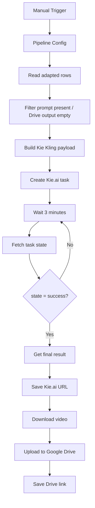

# cp04: Kling Video Generator via Kie.ai

Workflow file: [`cp04-kling-video-generator-kie.json`](cp04-kling-video-generator-kie.json)

## Purpose

This workflow compiles the saved Kling prompt into a Kie.ai request, creates the video task, polls for completion, saves the provider URL, downloads the result, uploads it to Google Drive, and updates the corresponding sheet row.

## Inputs and Idempotency

The workflow reads rows where `status=adapted`, then keeps rows where:

```text
final_prompt_kling is not empty
output_gd_kling is empty
```

Rows with a completed Drive output are excluded on reruns.

## Required Setup

Reconnect:

- `Google Sheets account`;
- `Google Drive account`;
- `Kie.ai API key` as an HTTP Header Auth credential.

Replace `YOUR_GOOGLE_DRIVE_ID` and `YOUR_OUTPUT_FOLDER_ID` in `Upload file`.

Confirm the configured Kie.ai model ID. The included default is:

```text
kling-3.0/video
```

## Main Flow



## Payload Construction

`Build Kie Kling Payload` parses `final_prompt_kling`, verifies the prompt length and spoken-brand rule, then creates:

```js
{
  model: config.generation.kling_model,
  input: {
    prompt,
    duration,
    aspect_ratio,
    mode,
    multi_shots,
    sound
  }
}
```

Normalization rules:

- duration: 3–15 seconds;
- aspect ratio: `1:1`, `9:16`, or `16:9`, otherwise `9:16`;
- mode: `std`, `pro`, or `4K`, otherwise `pro`.

## Polling

The workflow waits three minutes between status calls. It continues until Kie.ai returns `state=success`, then extracts the result URL, saves it, downloads the binary, and uploads it to Drive.

## Outputs

| Column | Stage | Value |
| --- | --- | --- |
| `output_kie_kling` | Provider result available | Kie.ai video URL |
| `kling_generation_status` | Provider result available | `kie_result_ready` |
| `output_gd_kling` | Upload complete | Google Drive link |
| `kling_generation_status` | Upload complete | `kling_generated` |
| `kling_generation_note` | Both stages | Compiled prompt length |

## Operational Notes

- There is currently no maximum polling retry count or explicit provider-failure branch.
- Add timeout/error handling before unattended high-volume automation.
- The Kie.ai URL is stored before Drive upload, making partial upload failures recoverable.
