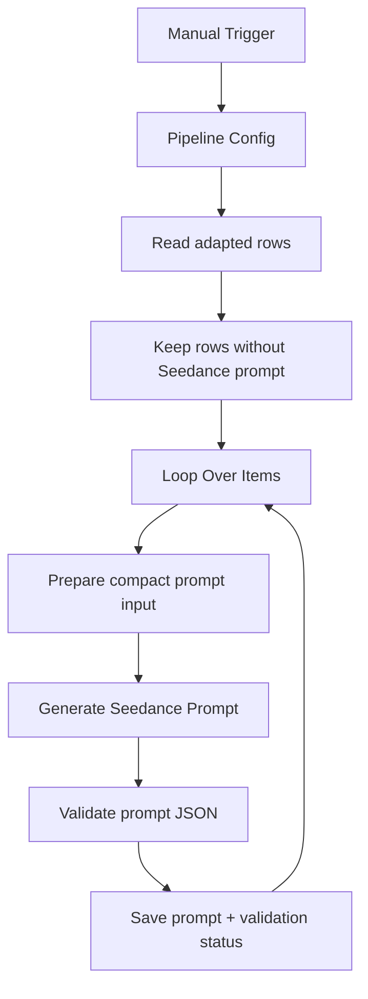

# cp03: Seedance Prompt Generator

Workflow file: [`cp03-seedance-prompt-generator.json`](cp03-seedance-prompt-generator.json)

## Purpose

This workflow turns an adapted creative concept into a production-ready Seedance prompt. It preserves the source visual anchor and adapted script while formatting the result for Seedance's longer, more descriptive prompt style.

It does not call Kie.ai or generate a video.

## Inputs and Eligibility

The workflow reads rows where:

```text
status = adapted
```

The `Filter` node keeps only rows where `final_prompt_seedance` is empty, which prevents successful prompts from being regenerated on reruns.

Required or strongly recommended fields:

- `shortcode`;
- `Adapter`;
- `DNA_Extractor`;
- `Original json file`;
- `score`.

## Main Flow



## Step-by-Step Logic

1. `Prepare Prompt Generator Input` parses the original breakdown, DNA, and Adapter JSON, then produces a compact source-fidelity brief.
2. `Generate Seedance Prompt` uses `gpt-4.1-mini` and the shared product configuration.
3. `Validate Seedance Prompt` checks JSON parsing, prompt length, spoken brand avoidance, model-branch correctness, and forbidden readable text/UI instructions.
4. `Save Seedance Prompt` updates the row by `shortcode`.

## Prompt Contract

The stored JSON contains:

- `creative_brief` with concept, hook, dialogue, shot plan, and exclusions;
- `seedance.prompt`;
- `seedance.negative_prompt`;
- duration and aspect ratio;
- a `qa` object.

The validator requires a non-empty Seedance prompt no longer than 5,000 characters. It also rejects:

- spoken use of the configured product name;
- an accidental `kling` output object;
- `overlay_text`;
- instructions to render UI, screenshots, captions, title cards, or other readable text.

## Outputs

| Column | Value |
| --- | --- |
| `final_prompt_seedance` | Validated JSON or raw model response on parse failure. |
| `seedance_generation_status` | `seedance_prompt_generated`, `seedance_prompt_needs_review`, or `seedance_prompt_parse_error`. |
| `seedance_generation_note` | Prompt length and validation flags, or parse error details. |

## Credentials

- `Google Sheets account`
- `OpenAI API account`

Review rows marked `needs_review` or `parse_error` before running `cp04`.
