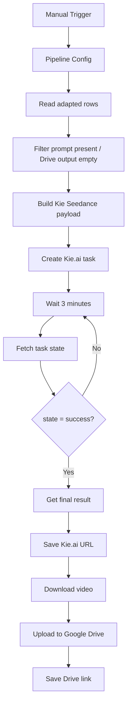

# cp04: Seedance Video Generator via Kie.ai

Workflow file: [`cp04-seedance-video-generator-kie.json`](cp04-seedance-video-generator-kie.json)

## Purpose

This workflow sends validated Seedance prompts to Kie.ai, polls the asynchronous task, saves the provider result URL, downloads the generated video, uploads it to Google Drive, and writes the final Drive link to `for_generating`.

## Inputs and Idempotency

The workflow reads rows where `status=adapted`, then keeps rows where:

```text
final_prompt_seedance is not empty
output_gd_seedance is empty
```

This allows safe reruns after partial failures while preventing rows with a completed Drive output from being generated again.

## Required Setup

Reconnect:

- `Google Sheets account`;
- `Google Drive account`;
- `Kie.ai API key` as an HTTP Header Auth credential.

In `Upload file`, replace:

```text
YOUR_GOOGLE_DRIVE_ID
YOUR_OUTPUT_FOLDER_ID
```

Confirm `Pipeline Config → generation.seedance_model` matches the model ID available in your Kie.ai account. The included default is `bytedance/seedance-2`.

## Main Flow



## Payload Construction

`Build Kie Seedance Payload` parses `final_prompt_seedance`, checks that `seedance.prompt` exists and is no longer than 5,000 characters, and blocks spoken use of the configured product name.

The payload contains:

```js
{
  model: config.generation.seedance_model,
  input: {
    prompt,
    duration,
    aspect_ratio,
    resolution: "1080p",
    generate_audio: true
  }
}
```

Duration is normalized to a range of 4–15 seconds.

## Polling

After task creation, the workflow waits three minutes and calls Kie.ai `recordInfo`. If the returned state is not `success`, it loops back to the Wait node. When successful, it fetches the final result and extracts a video URL from the supported Kie.ai result shapes.

## Outputs

| Column | Stage | Value |
| --- | --- | --- |
| `output_kie_seedance` | Provider result available | Kie.ai video URL |
| `seedance_generation_status` | Provider result available | `kie_result_ready` |
| `output_gd_seedance` | Upload complete | Google Drive link |
| `seedance_generation_status` | Upload complete | `seedance_generated` |
| `seedance_generation_note` | Both stages | Compiled prompt length |

## Operational Notes

- The current polling loop has no maximum retry count. Add a timeout/error branch if you automate unattended execution.
- A Kie.ai failure state that never becomes `success` will continue polling. Monitor executions or extend the `If ready` logic for provider-specific failure states.
- `output_kie_seedance` is written before download/upload, so a failed Drive upload can be retried without losing the provider URL.
